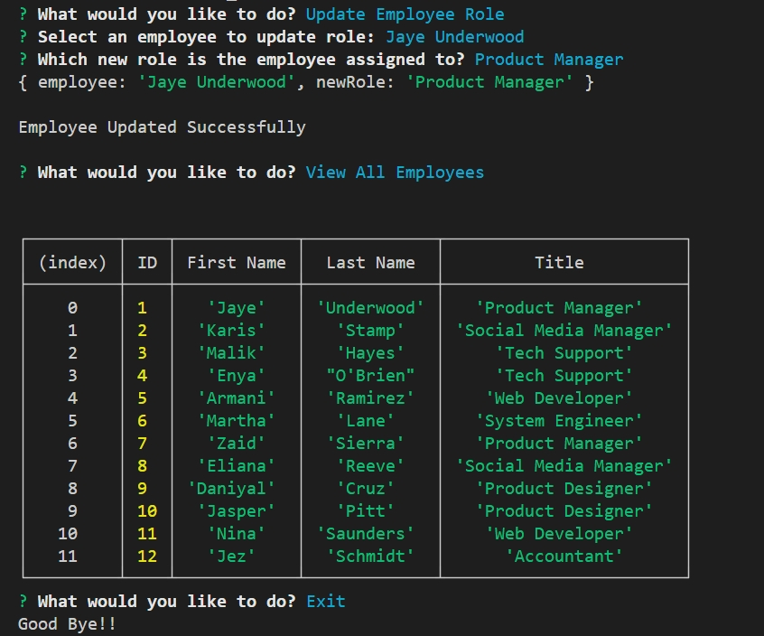

# Employee Management System

## Description

- This app was created to help businesses to manage employees.
- You can create and view employees, roles, and departments.
- You can also update/assign employees to new roles.

## Table of Contents

- [Employee Management System](#employee-management-system)
  - [Description](#description)
  - [Table of Contents](#table-of-contents)
  - [Installation](#installation)
  - [Usage](#usage)
  - [License](#license)
  - [How to Contribute](#how-to-contribute)
  - [Tests](#tests)
  - [Credits](#credits)
  - [Questions and Inquiry](#questions-and-inquiry)

## Installation

- Download this package from this repository.
- Install MySQL.
- Install npm dependencies using 'npm i' in the CLI.
- Change '.env_sample' file to '.env' and change the enviroment variables to the appropriate logins.
- Run using 'node index.js' command.

## Usage

- Use schema.sql in db folder to create and seed the databases.
- Run the application.
- Use arrow keys for selections in menu.
- Menu will be infinitely looped, just something to be aware of.

## License

All copyrights are covered under the Apache 2.0 license

## How to Contribute

- Please contact through GitHub.

## Tests

- N/A

## Credits

- Hao Zhou

## Questions and Inquiry

[GitHub Profile](#https://github.com/roflmelon)

For any questions or inquiries, you can contact me at:
harryhz508@gmail.com
